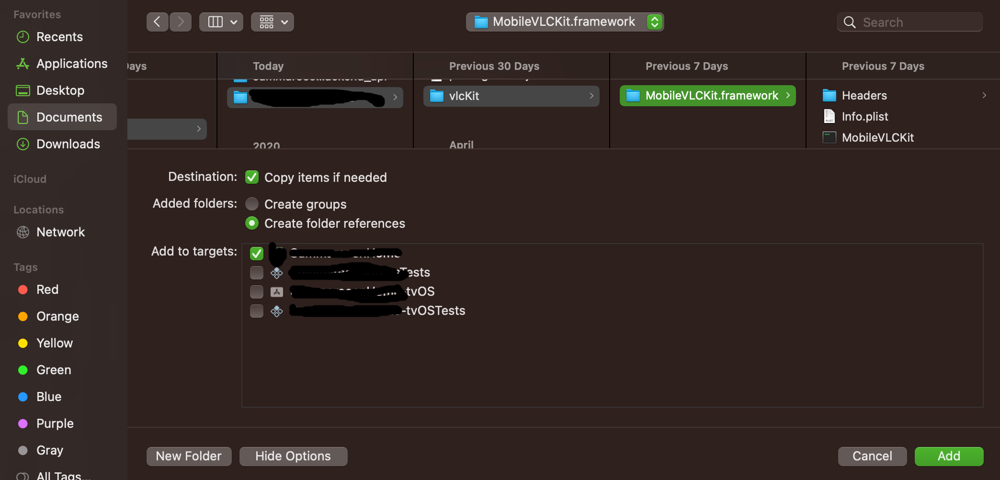
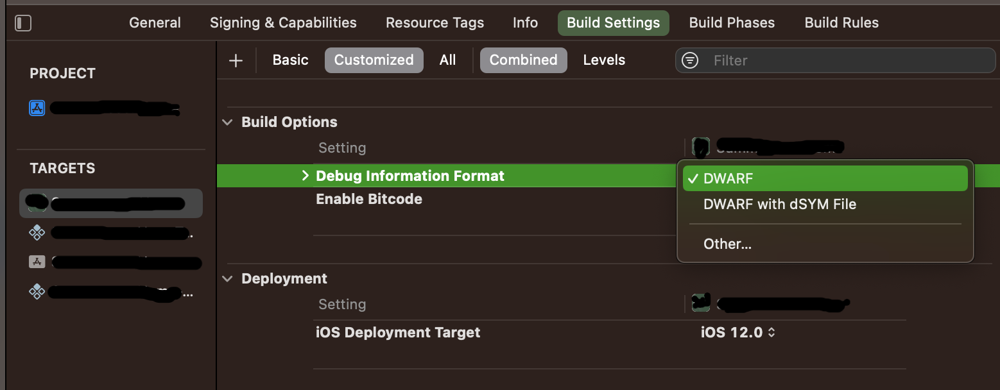

# react-native-vlc-rtsp

## Introduction

Library for Real-Time Video Stream RTSP in React Native.
Now, support on Android and iOS.

component for react-native project clone from `react-native-yz-vlcplayer` with modify script for iOS compatibility (also bahasa language).

## Supported RN Versions

0.59 > 0.62 and up PODs are updated to works with 0.61 and up.(Tested in 0.61.5 and 0.62 and 0.63)

## Supported formats

Support for network streams, RTSP, RTP, RTMP, HLS, MMS.
Play all files,[ in all formats, including exotic ones, like the classic VLC media player.](#-More-formats)
Play MKV, multiple audio tracks (including 5.1), and subtitles tracks (including SSA!)

### Add it to your project

Run

`npm i react-native-vlc-rtsp --save`

or

`yarn add react-native-vlc-rtsp`

Run

`react-native link react-native-vlc-rtsp`


## Android
Should work without any specific settings, but make sure your RN project has installed library `react-native-slider`.

## iOS Setup

1. cd to ios

2. run `pod init` (if only Podfile has not been generated in ios folder)

3. add `pod 'MobileVLCKit', '3.3.10'` to pod file **(No need if you are running RN 0.61 and up)**

4. run `pod install` (you have to delete the app on the simulator/device and run `react-native run-ios` again)'

5. in ios/podfile add this line
   `pod 'react-native-vlc-rtsp', :path => '../node_modules/react-native-vlc-rtsp'`
   `pod 'MobileVLCKit'`

6. in ios/YourProject/AppDelegate.m add new import
   `#import <RCTVLCPlayer.h>`

7. in XCode, select project folder > Framework folder > Right Click > Add Files to “Project Name..” > Select `MobileVLCKit.framework` > Select options (in Destination, select Copy item if needed, in Add to target, select “ProjectName” only)
    

8. in XCode, select project folder > Build Settings > Build Options 
	- Debug Information Format = `DWARF`
  

9. in XCode, select project folder > Build Settings > Search Path
	- Library Search Path (Debug & release)
  add this:
  `$(SRCROOT)/../node_modules/react-native-vlc-rtsp/ios/RCTVLCPlayer/vlcKit`
	`$(SRCROOT)/../node_modules/react-native-vlc-rtsp/ios`
  `$(SRCROOT)/../node_modules/react-native-vlc-rtsp/ios/RCTVLCPlayer/vlcKit/MobileVLCKit.framework`


## How to Use

```
import { VLCPlayer, VlCPlayerView } from 'react-native-vlc-rtsp';

    <VLCPlayer
        style={[styles.video]}
        videoAspectRatio="16:9"
        source={{ uri: "https://www.radiantmediaplayer.com/media/big-buck-bunny-360p.mp4"}}
    />

or you can use

    <VlCPlayerView
          autoplay={false}
          url="https://www.radiantmediaplayer.com/media/big-buck-bunny-360p.mp4"
          ggUrl=""
          showGG={true}
          showTitle={true}
          title="Buck Bunny"
          showBack={true}
          onLeftPress={()=>{}}
       />
```

### VLCPlayer Props

| Prop                | Description                                                                                                                                          | Default |
| ------------------- | ---------------------------------------------------------------------------------------------------------------------------------------------------- | ------- |
| `source`            | Object that contains the uri of a video or song to play eg `{{ uri: "https://video.com/example.mkv" }}`                                              | `{}`    |
| `subtitleUri`       | local subtitle file path，if you want to hide subtitle, you can set this to an empty subtitle file，current we don't support a `hide subtitle` prop. |         |
| `paused`            | Set to `true` or `false` to pause or play the media                                                                                                  | `false` |
| `repeat`            | Set to `true` or `false` to loop the media                                                                                                           | `false` |
| `rate`              | Set the playback rate of the player                                                                                                                  | `1`     |
| `seek`              | Set position to seek between `0` and `1` (`0` being the start, `1` being the end , use `position` from the progress object )                         |         |
| `volume`            | Set the volume of the player (`number`)                                                                                                              |         |
| `muted`             | Set to `true` or `false` to mute the player                                                                                                          | `false` |
| `audioTrack`        | Set audioTrack id (`number`) (see `onLoad` callback VideoInfo.audioTracks)                                                                           |         |
| `textTrack`         | Set textTrack(subtitle) id (`number`) (see `onLoad` callback- VideoInfo.textTracks)                                                                  |         |
| `playInBackground`  | Set to `true` or `false` to allow playing in the background                                                                                          | false   |
| `videoAspectRatio ` | Set the video aspect ratio eg `"16:9"`                                                                                                               |         |
| `autoAspectRatio`   | Set to `true` or `false` to enable auto aspect ratio                                                                                                 | false   |
| `resizeMode`        | Set the behavior for the video size (`fill, contain, cover, none, scale-down`)                                                                       | none    |
| `style`             | React native stylesheet styles                                                                                                                       | `{}`    |

#### Callback props

Callback props take a function that gets fired on various player events:

| Prop           | Description                                                                                                                                                                                                          |
| -------------- | -------------------------------------------------------------------------------------------------------------------------------------------------------------------------------------------------------------------- |
| `onPlaying`    | Called when media starts playing returns eg `{target: 9, duration: 99750, seekable: true}`                                                                                                                           |
| `onProgress`   | Callback containing `position` as a fraction, and `duration`, `currentTime` and `remainingTime` in seconds <br />&nbsp; ◦ &nbsp;eg `{  duration: 99750, position: 0.30, currentTime: 30154, remainingTime: -69594 }` |
| `onPaused`     | Called when media is paused                                                                                                                                                                                          |
| `onStopped `   | Called when media is stoped                                                                                                                                                                                          |
| `onBuffering ` | Called when media is buffering                                                                                                                                                                                       |
| `onEnded`      | Called when media playing ends                                                                                                                                                                                       |
| `onError`      | Called when an error occurs whilst attempting to play media                                                                                                                                                          |
| `onLoad`       | Called when video info is loaded, Callback containing VideoInfo                                                                                                                                                      |

VideoInfo example:

```
 {
    duration: 30906,
    videoSize: {height: 240, width: 32},
    audioTracks: [
            {id: -1, name: "Disable"},
            {id: 1, name: "Track 1"},
            {id: 3, name: "Japanese Audio (2ch LC-AAC) - [Japanese]"}
    ],
    textTracks: [
        {id: -1, name: "Disable"},
        {id: 4, name: "Track 1 - [English]"},
        {id: 5, name: "Track 2 - [Japanese]"}
    ],
}
```

## More formats

Container formats: 3GP, ASF, AVI, DVR-MS, FLV, Matroska (MKV), MIDI, QuickTime File Format, MP4, Ogg, OGM, WAV, MPEG-2 (ES, PS, TS, PVA, MP3), AIFF, Raw audio, Raw DV, MXF, VOB, RM, Blu-ray, DVD-Video, VCD, SVCD, CD Audio, DVB, HEIF, AVIF
Audio coding formats: AAC, AC3, ALAC, AMR, DTS, DV Audio, XM, FLAC, It, MACE, MOD, Monkey's Audio, MP3, Opus, PLS, QCP, QDM2/QDMC, RealAudio, Speex, Screamtracker 3/S3M, TTA, Vorbis, WavPack, WMA (WMA 1/2, WMA 3 partially).
Capture devices: Video4Linux (on Linux), DirectShow (on Windows), Desktop (screencast), Digital TV (DVB-C, DVB-S, DVB-T, DVB-S2, DVB-T2, ATSC, Clear QAM)
Network protocols: FTP, HTTP, MMS, RSS/Atom, RTMP, RTP (unicast or multicast), RTSP, UDP, Sat-IP, Smooth Streaming
Network streaming formats: Apple HLS, Flash RTMP, MPEG-DASH, MPEG Transport Stream, RTP/RTSP ISMA/3GPP PSS, Windows Media MMS
Subtitles: Advanced SubStation Alpha, Closed Captions, DVB, DVD-Video, MPEG-4 Timed Text, MPL2, OGM, SubStation Alpha, SubRip, SVCD, Teletext, Text file, VobSub, WebVTT, TTML
Video coding formats: Cinepak, Dirac, DV, H.263, H.264/MPEG-4 AVC, H.265/MPEG HEVC, AV1, HuffYUV, Indeo 3, MJPEG, MPEG-1, MPEG-2, MPEG-4 Part 2, RealVideo 3&4, Sorenson, Theora, VC-1,[h] VP5, VP6, VP8, VP9, DNxHD, ProRes and some WMV.

## credits

[iswahyud](https://github.com/iswahyud) 

[xuyuanzhou](https://github.com/xuyuanzhou)

## author

Iswahyudi > [Visit Google Developer Profile](https://g.dev/yudi)

